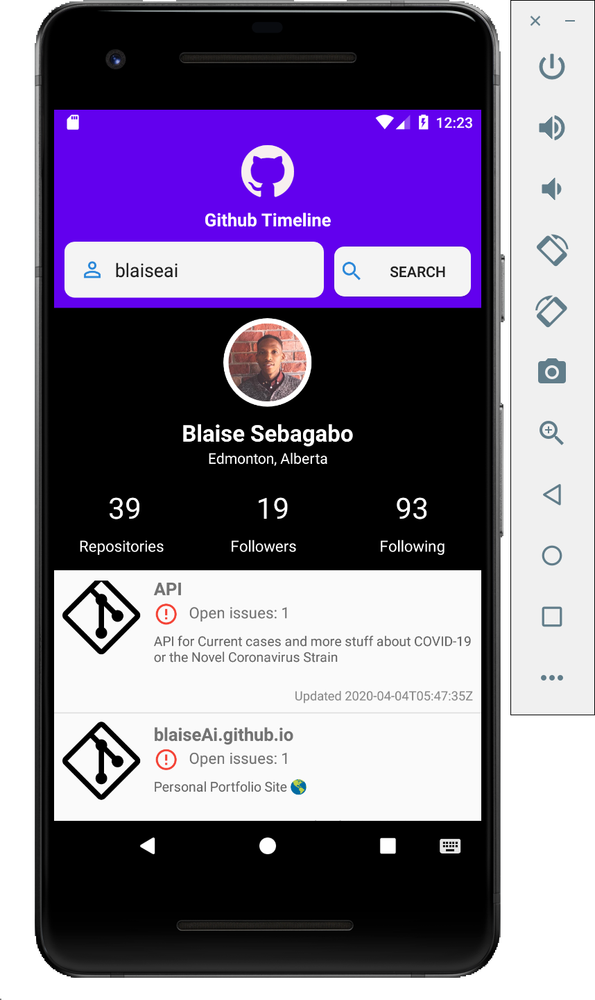

# GitHub Timeline

The goal of  my GitHub Timeline Application  is to  accept a GitHub user name and makes and HTTP Request to to github API produce a timeline containing each repo and annotated with the repo names, Open Issues, and their descriptions, the date they were created. 
> Note: Only public repos is displayed.
 ## Technologies and frameworks used
    1. java 11
    2. Android
    3. Gradle 4.10
    4. okHttp

## Prerequisites
    Android SDK v28
    Latest Android Build Tools

## Setup and installation
    1. Clone the repo
    2. Open using android studio
    3. If prompted for a gradle configuration, accept the default settings. Alternatively use the "gradlew build" command to build the project directly.
    4. Setup Emulator or connect an android phone and enable USB debugging
    5. Run the app

## API
https://api.github.com/

## Issues
There are no known bugs in the application but if you encounter any please open an [new issue](https://github.com/blaiseAI/githubtimeline/issues/new) on this repo.

## Screenshots

